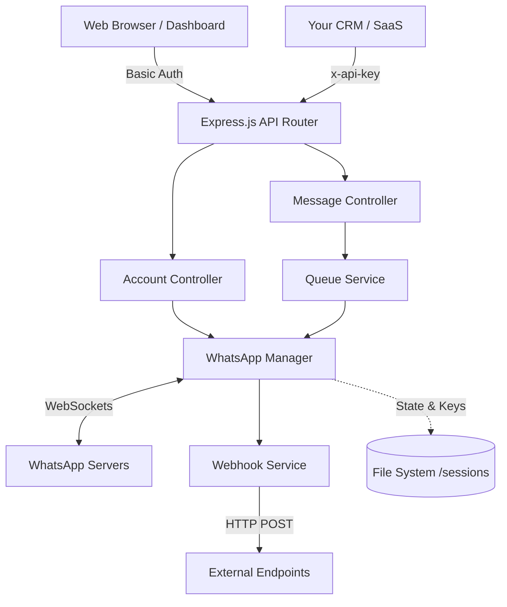

# WhatsApp Automation Server

A production-ready, lightweight, self-hosted WhatsApp API server built with Node.js and `@whiskeysockets/baileys`. Designed specifically to run efficiently on low-resource Virtual Private Servers (VPS) while providing multi-account support, a visual dashboard, and scalable REST APIs.

---

## 🎯 Purposes and Possibilities

This system is built as a lightweight alternative to Evolution API or ChatAPI.

**Purposes:**
- Self-host your own WhatsApp API without paying monthly SaaS fees.
- Connect multiple WhatsApp accounts (e.g., Marketing, Support, Sales) in one central hub.
- Integrate WhatsApp messaging directly into your internal CRM, ERP, or web applications.

**Possibilities:**
- **Automated Alerts:** Send server alerts, OTPs, or transaction receipts to your customers.
- **Bulk Marketing:** Using the built-in queuing system, safely execute broadcast campaigns with organic delays to avoid bans.
- **Customer Support Bot:** Forward incoming webhook messages to an AI (like OpenAI) or a human interface to build intelligent auto-responders.
- **SaaS Foundation:** The architecture is modular. You can easily extend this to offer "WhatsApp API as a Service" to your own clients.

---

## 🏗️ Architecture & Flow Diagram

The application uses an event-driven architecture, avoiding heavy databases in favor of fast, memory-efficient JSON file storage.



---

## 🚀 VPS Deployment Guide

This guide is optimized for a fresh **Debian 12 / Ubuntu 22.04+** server (e.g., AWS Lightsail 1GB RAM / 2vCPU).

### 1. Initial Server Setup & Dependencies
Connect to your VPS via SSH and run the following commands to install Node.js 20, Nginx, and PM2.

```bash
# Update system
sudo apt update && sudo apt upgrade -y

# Install curl
sudo apt install curl -y

# Install Node.js v20
curl -fsSL https://deb.nodesource.com/setup_20.x | sudo -E bash -
sudo apt install -y nodejs

# Install Nginx (For reverse proxy and SSL)
sudo apt install nginx -y

# Install PM2 globally (Process manager)
sudo npm install -g pm2
```

### 2. Clone and Setup Project
```bash
# Clone the repository (replace with your git URL if applicable)
# Or use SFTP/SCP to upload the project folder to /var/www/whatsapp-server
mkdir -p /var/www
cd /var/www

# Assuming project is uploaded to /var/www/whatsapp-server
cd whatsapp-server

# Install project dependencies
npm install --production
```

### 3. Environment Configuration
Ensure your `.env` file is configured correctly for production. We recommend running the Node.js app on port `3000` internally, and using Nginx to expose port `80` (HTTP) or `443` (HTTPS) to the outside world.

```bash
nano .env
```
Ensure it contains:
```env
PORT=3000
API_KEY=your_secure_api_key_here
NODE_ENV=production
DASHBOARD_USERNAME=admin
DASHBOARD_PASSWORD=your_secure_password
```

### 4. Start with PM2
PM2 will keep the app running forever and auto-restart it if the VPS reboots.

```bash
# Start the application
pm2 start server.js --name "whatsapp-server"

# Save the PM2 list
pm2 save

# Setup PM2 to start on server boot
pm2 startup
# (Run the command that PM2 outputs on the screen)
```

### 5. Nginx Reverse Proxy Setup (Highly Recommended)
Running Node.js directly on port 80 requires root access. It is much safer to run Nginx on port 80 and route traffic to your app running on port 3000.

```bash
sudo nano /etc/nginx/sites-available/whatsapp
```

Paste the following configuration (replace `your_server_ip` if you have a domain):
```nginx
server {
    listen 80;
    server_name your_server_ip;

    location / {
        proxy_pass http://localhost:3000;
        proxy_http_version 1.1;
        proxy_set_header Upgrade $http_upgrade;
        proxy_set_header Connection 'upgrade';
        proxy_set_header Host $host;
        proxy_cache_bypass $http_upgrade;
    }
}
```

Enable the configuration and restart Nginx:
```bash
sudo ln -s /etc/nginx/sites-available/whatsapp /etc/nginx/sites-enabled/
sudo rm /etc/nginx/sites-enabled/default
sudo systemctl restart nginx
```

🎉 **Your server is now live!** Open your VPS IP address in a browser to view the Dashboard.

---

## 💻 Usage Guide

### Using the Dashboard
1. Open your server IP in a web browser.
2. Enter the username and password defined in your `.env` file.
3. Navigate to **Accounts** and click `+ Add New Account`.
4. Enter a unique ID (e.g., `sales_1`).
5. Click **Scan QR**. Open the WhatsApp App on your phone > Linked Devices > Link a Device.
6. The status will automatically change to `Connected`.

### Using the APIs
To communicate with the server from your external apps, you must pass your API key.

**Authentication:**
Pass the key in the headers: `x-api-key: your_secure_api_key_here`

#### 1. Get Accounts Status
```http
GET /api/accounts
x-api-key: your_secure_api_key_here
```

#### 2. Send a Message
```http
POST /api/messages/send
x-api-key: your_secure_api_key_here
Content-Type: application/json

{
  "account": "sales_1",
  "number": "919999999999",
  "message": "Hello from the new API server!"
}
```

#### 3. Receiving Webhooks (Future Feature)
When a message is received on WhatsApp, the server will `POST` the data to your configured CRM webhook endpoint in real-time.

---

## ⚙️ Performance Tuning (For 1GB RAM)
- Do not run heavy build steps (`npm run build`) on the server.
- The app uses `pino` for low-overhead logging.
- Session credentials are saved incrementally. Over months of use, if `sessions/` directory grows too large, clearing disconnected sessions will free up inodes/space.
